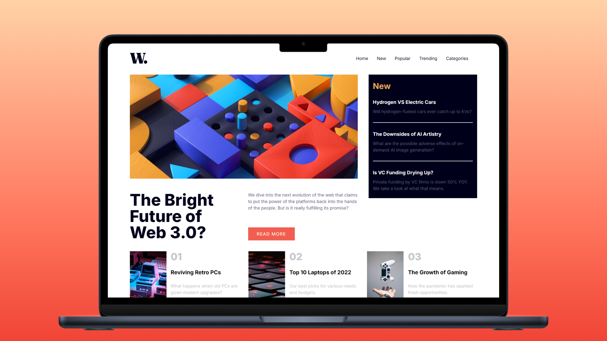

<h1 align="center">News Home Page</h1>

<p align="left">
  <a href="README_ES.md" target="_blank">
    Ver README en Español
  </a>
</p>

<p>
  This project is my personal interpretation of the "News Homepage" challenge by Frontend Mentor. The main goal was to strengthen my skills in HTML, CSS, Tailwind CSS, and JavaScript. Throughout the process, I tackled key decisions including semantic HTML structure, layout design with CSS Grid, and the integration of Tailwind—from setup and configuration to production bundling. Additionally, JavaScript was used to implement an interactive hamburger menu, adding a layer of interactivity to the overall experience.
</p>

<hr>

<h1 align="center">Technologies Used</h1>

<div align="center">
  
  
  
  
</div>

<hr>

<h1 align="center">Objective</h1>

<p>
  The News Homepage was a great opportunity to apply and refine my skills with CSS Grid for layout creation. Design decisions played a critical role in building an aesthetically pleasing and functional interface. Tailwind CSS provided speed and consistency in styling, while JavaScript added interactivity by enabling a responsive hamburger menu for mobile navigation.
</p>

<hr>

<h1 align="center">Main Features</h1>

<ul>
  <li><b>Responsive Design:</b> Built with CSS Grid and Tailwind CSS to ensure adaptability across various screen sizes and devices.</li>
  <li><b>Tailwind CSS:</b> Full exploration of Tailwind CSS—from installation and configuration to using utility classes for styling components efficiently.</li>
  <li><b>Deployment Process:</b> Bundling and deployment prepared for production, serving as a reference for future professional setups.</li>
  <li><b>Interactive Hamburger Menu:</b> JavaScript-driven hamburger navigation enhances user experience on mobile devices.</li>
</ul>

<hr>

<h1 align="center">Skills Acquired</h1>

<ul>
  <li>Strengthened understanding of HTML and CSS fundamentals.</li>
  <li>Applied CSS Grid to build clean and responsive layouts.</li>
  <li>Gained hands-on experience with Tailwind CSS, from installation to production-ready bundling.</li>
  <li>Implemented JavaScript logic for interactive UI components.</li>
</ul>

<hr>

<h1 align="center">How to Use</h1>

1. Clone this repository to your local machine:

   ```sh
   git clone https://github.com/jordanmedinaortiz/news-home-page.git
   cd news-home-page
  
2. Install the necessary dependencies (requires Node.js):
   ```sh
   npm install

3. Run the development server:
   ```sh
   npm run dev

4. Open your browser and navigate to the URL indicated in the terminal (usually: http://localhost:5173 or similar).

5. To compile the files and generate a production-ready version, run:
    ```sh
   npm run build

<p>This project not only strengthened my essential web development skills, but also demonstrated how to successfully integrate a modern framework like Tailwind CSS into a practical, professional challenge. </p>
<p>You can view the project demo <a href="https://jordanmedinaortiz.github.io/news-home-page/" target="_blank">here</a>.
</p> 
